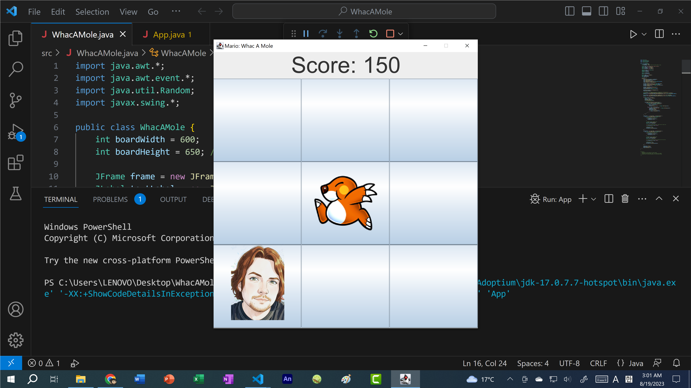

# [Whac a Mole (Java)](https://youtu.be/rIQksHTwZzA)
- Coding Tutorial: [https://youtu.be/ej8SatOj3V4](https://youtu.be/rIQksHTwZzA)

**Please note**: this project is the work of Kenny Yip (https://www.youtube.com/@KennyYipCoding) who is an excellent
programmer. I have merely adjusted parts of this code for my own understanding of the underlying concepts. Please go 
and check out Kenny's channel and subscribe to his work: also found at https://www.kennyyipcoding.com/.

|              |                                                                                                                                |
|--------------|--------------------------------------------------------------------------------------------------------------------------------|
| Demo Link    | [whac-a-mole.lyle.app](https://whac-a-mole.lyle.app)                                                                           |
| Tech Stack   | Java 18                                                                                                                        | JSON Simple | Meteomatics API | JavaFX | HTTPURLConnection |
| Cloud Deploy |  |
| Top Language |                           |
| Last Commit  |                 |

[How to setup Java with Visual Studio Code](https://youtu.be/BB0gZFpukJU)

